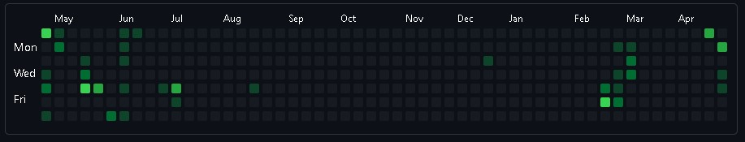

# **Contributions prettier**

The objective of this project is to re-create a contributions calendar, as GitHub one does, but use it as playground for draw forms over it. 

I will use this functionality to create an Electron app, where you can simulate this board into different ways and colors. Much more comes to my mind but let's see what happens. I use this project to learn and practice more, from algorithms to new enviroments such as Desktop apps.

## **GitHubCalendar Class**

### Parameters

| Name | Type | Description |
| --------- | ---- | ----------- |
| parent | HTMLElement | Parent element to render inside.
| contributions | Object | List to turn calendar dates on. eg. `{ "4/27/2021": 4, "4/25/2021": 2, }`, where numeric value comes from range `[0-4]` to indicate changes proportion.

### Methods

- `setContributions(contributions): void`

    It will replace contributions with entered through new object parameter.

    | Parameter | Type | Description |
    | --------- | ---- | ----------- |
    | contributions | Object | List to turn calendar dates on. eg. `{ "4/27/2021": 4, "4/25/2021": 2, }`, where numeric value comes from range `[0-4]` to indicate changes proportion. 

## **Progress demo**



This is a copy my contributions board status. 

## **You can try it out by following bellow steps:**

1. Go to a GitHub profile page.
2. Open browser inspector by pressing `F12` in your keyboard, also using shortcuts such as `fn + F12` or `Ctrl + Shift + i`.
3. Copy/paste code below in the console. The object will be copied automatically.
4. Use object as second parameter for `GitHubCalendar` class instance, located in `./src/js/main.js` file.
5. Run app with `npm start` command.

```JavaScript
    const calendar = document.querySelector(".js-calendar-graph-svg");
    const wrapper = calendar.children[0];
    const contributions = {};

    for(let i = 0; i < wrapper.children.length; i++) {
        const child = wrapper.children[i];
        
        if (child.tagName !== "g") continue;
        
        for(let j = 0; j < child.children.length; j++) {
            const date = child.children[j];
            const year = +date.getAttribute("data-date").split("-")[0];
            const month = +date.getAttribute("data-date").split("-")[1];
            const day = +date.getAttribute("data-date").split("-")[2];
            const formattedDate = new Date(year, month - 1, day);
            const level = +date.getAttribute("data-level");

            if (level === 0) continue;
            
            contributions[formattedDate.toLocaleDateString("EN")] = level;
        }
    }

    copy(JSON.stringify(contributions));
    console.warn("COPIED!");
```

## **Project stack (What do I use?)**
- Electron
- JavaScript
- CSS Grid

## **Any feedback?? 🤔 If so, create issue or PR!** 😏 

I will appreciate any feedbacks you could give me. Thanks

