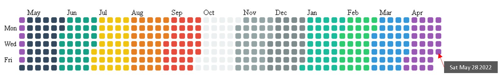

# Contributions prettier

The objective of this project is to re-create a contributions calendar, as GitHub one does, but use it as playground for draw forms over it. 

Gave it a color for each month for initialy testing, but later on, I will only leave one single color and four scales for such color.

**Progress demo**

**Promises**

- Remove colors and only leave one single color scale
- Create Calendar class
- Create Drawer class

**Questions (Create issues)**

- Some more improvements?

