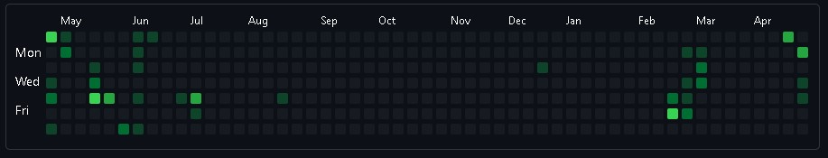

# Contributions prettier

The objective of this project is to re-create a contributions calendar, as GitHub one does, but use it as playground for draw forms over it. 

I will use this functionality to create an Electron app, where you can simulate this board into different ways and colors. Much more comes to my mind but let's see what happens. I use this project to learn and practice more, from algorithms to new enviroments such as Desktop apps.

**Progress demo**



This is a copy my contributions board status. 

**You can try it out by following bellow steps:**

1. Go to a GitHub profile page.
2. Open browser inspector by pressing `F12` in your keyboard, also using shortcuts such as `fn + F12` or `Ctrl + Shift + i`.
3. Copy/paste code below in the console. The object will be passed to the clipboard.
4. Use object as parameter to `GitHubCalendar` class instance, located in `main.js` file.

```JavaScript
    const calendar = document.querySelector(".js-calendar-graph-svg");
    const wrapper = calendar.children[0];
    const cont = {};

    for(let i = 0; i < wrapper.children.length; i++) {
        const child = wrapper.children[i];
        
        if (child.tagName !== "g") continue;
        
        for(let j = 0; j < child.children.length; j++) {
            let date = child.children[j];
            let year = +date.getAttribute("data-date").split("-")[0];
            let month = +date.getAttribute("data-date").split("-")[1];
            let day = +date.getAttribute("data-date").split("-")[2];
            let formattedDate = new Date(year, month - 1, day);
            let level = +date.getAttribute("data-level");

            if (level === 0) continue;
            
            cont[formattedDate.toLocaleDateString("EN")] = level;
        }
    }

    copy(JSON.stringify(cont));
    console.warn("COPIED!");
```

**Any feedback?? 🤔 (Create issues)**

I will appreciate any feedbacks you could give me. Thanks

